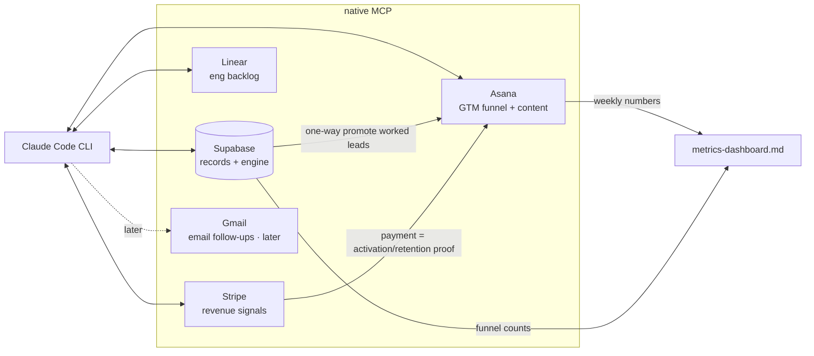

# TopFarms GTM — System Architecture

*2026-07-02 · Where the funnel lives and runs. Hybrid: Supabase = system of record + engine; Asana = human work surface; Linear = engineering. Native MCP throughout (see `tooling-decision.md`).*

## CRM / source of truth — hybrid, no bidirectional sync

- **Supabase = system of record + engine.** Already built, RLS'd, feeds the Firecrawl harvest track. Owns: `lead_staging` → `leads` → `lead_suppression`, the Outreach queue (`drafted → approved → sent → responded`, Lane A = has contact / Lane B = no contact → drafted first message), dedup, and drafted messages via `admin_outreach_set_config`. Harry approves + sends every message manually.
- **Asana = human work surface.** One card per **actively-worked employer target** (custom fields = the 14-field schema below; sections = funnel stages), plus the content calendar, partnership tracker, and weekly cadence. Non-technical, handoff-ready to a future hire.
- **Promotion is one-way: Supabase → Asana** at the moment you start actively working a lead ("contacted" onward). Suppression + dedup never leave Supabase. No sync-back nightmare.
- **Seekers are NOT Asana cards.** Per the seeker engine, most seekers arrive by pull → tracked as **aggregate Supabase signups**. Only the ~30/day cold-DM supplement seekers get light per-target tracking (see seeker schema).

## Boundary: GTM never in Linear, engineering never in Asana

- **Asana** = anything a future GTM hire would touch: outreach pipeline, content, partnerships, sales cadence.
- **Linear** = the PRD quality gates (`tsc -b` errors, no frontend CI, bundle size) + feature backlog. One team, gates as issues, light on cycles for now (eng is largely quiescent).

## Integration map

Data flow, plainly:
- Harvest/paste → `lead_staging` → approve → `leads` (Supabase).
- Start working a lead → Claude Code reads the approved `leads` row and creates an Asana card with the 14 fields.
- Stage moves / reply logging / follow-up scheduling happen on the Asana card (Claude drives via `update_tasks` + `add_comment`).
- Stripe payment (listing/placement) = the activation/retention signal; surfaced into metrics, not a new CRM.

## The 14-field EMPLOYER target-list schema (Asana custom fields)

Reconstructed from the Playbook (which references but never lists the 14 fields — see `funnel-design.md` note) + the live Supabase `leads` columns. **Cells marked ⟨recon⟩ go beyond what the Playbook documents — reconcile later.**

| # | Field | Maps to `leads` / note |
|---|---|---|
| 1 | Farm / business name | `display_name` |
| 2 | Contact name | ⟨recon⟩ new |
| 3 | Region (16 NZ) | `region` |
| 4 | Farm type / stock class (dairy·sheep-beef·…) | `role_or_category` + ag-broad tag (dairy-first) |
| 5 | Shed type (rotary/herringbone) | ⟨recon⟩ new, dairy |
| 6 | Role(s) hiring | from post/listing |
| 7 | Source (FB·Seek·TradeMe·referral) | `source` |
| 8 | Source ref (post/listing URL) | `source_ref` |
| 9 | Contact channel + detail (publicly-stated only) | `contact` jsonb |
| 10 | Fit tier (A/B/C) | ⟨recon⟩ new |
| 11 | Stage (raw-target → … → retained) | Asana section |
| 12 | Last touch / next action date | ⟨recon⟩ new |
| 13 | Touch count / cadence position | ⟨recon⟩ new |
| 14 | Notes (war story, personalisation hook, milking pattern) | `notes` |

## The seeker tracking schema (lighter, split from employers)

Most seekers = **aggregate only** (Supabase signups: count, region, farm-type interest, source channel, date). No Asana card.

The ~30/day **cold-DM supplement** seekers get light per-target tracking (a small Supabase table or a single Asana "Seeker DM" section), 6 fields:
1. Name/handle · 2. Region · 3. Role/experience signal (from their post) · 4. Source post ref · 5. Stage (raw-target → contacted → replied → onboarded — a subset of the spine, same words) · 6. Notes.

Do **not** force the 14-field employer set onto seekers.

## Asana project/section/field structure

- **Project: "Employer Pipeline"** — sections = funnel stages (Raw target · Contacted · Replied · Qualified · Onboarded · Activated · Retained); custom fields = the 14 above.
  > Naming: these Title-Case Asana section labels are the display form of the canonical spine ids in `funnel-design.md` (`raw-target · contacted · replied · qualified · onboarded · activated · retained`). Same seven stages, one for machines, one for the board.
- **Project: "Content Calendar"** — sections = the 4 weekly themes (We exist · What we do · It works · Join us); fields = channel, format, status, publish date.
- **Project: "Partnerships"** — sections = the escalation ladder rungs; fields = tier (govt/industry/education), contact, next action.
- **Project: "Founder Cadence"** — recurring weekly tasks (see `weekly-operating-rhythm.md`).
- **Linear team: "TopFarms Eng"** — the three quality gates as issues + backlog; labels: `quality-gate`, `bug`, `feature`.
